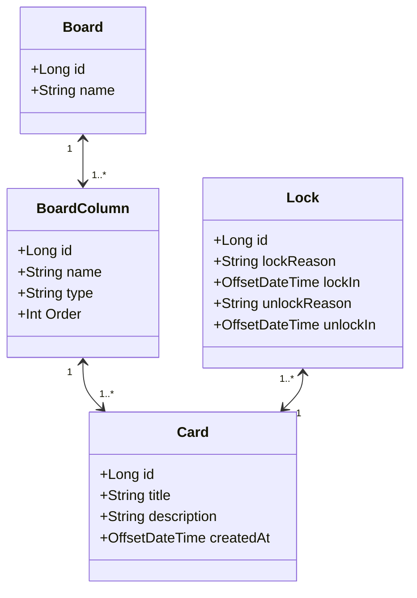

# Decola Tech 2025 Board

## Specification
### Task Management Board Project

Write an application that creates a customizable board for task tracking

#### Requirements
    1. The application should present a menu with the following options at startup: Create New Board, Select Board, Delete Board, Exit.
    2. The application should store the board and its details in a MySQL database.

#### Board Structure
    1. Each Board must have a name and contain at least three columns: one for initial tasks, one for completed tasks and one for canceled tasks. The column names must be customizable.
    2. Each column must have a name, a display order and a type: To Do, In Progress, Completed and Canceled.
    3. Each board can have only one column for each of the following types: To Do, Canceled and Completed. In Progress columns can be added as nedded. The To Do column must be the first column, the Completed column must be the second-to-last and the Canceled column must be the last.
    4. Columns can contain 0 or more cards. Each card should have a title, description, creation date and a "locked" status.
    5. Cards must move through columns in the predefined order of the board. They cannot skip any stage unless moved to the Canceled column, which can accept cards from any column other than Completed.
    6. A locked card cannot be moved until it is unlocked.
    7. To lock a card, a reason for the lock must be provided. Similarly, to unlock a card, a reason must also be provided
    
#### Board Management Menu
    1. The menu for managin the selected board must allow the following actions: Move Card to Next Column, Cancel Card, Create Card, Lock Card, Unlock Card and Close Board.

#### Optional Requirements
    1. Each card should track the date and time it was added to a column and the date and time it was moved to the next column.
    2. The application should generate a report for the selected board, detailing the time it took for each task to be completed, including the time spent on each column.
    3. The application should generate a report for the selected board, detailing the lock events of the cards, including the duratio of each lock and the reasons for locking/unlocking.

## Class Diagram

